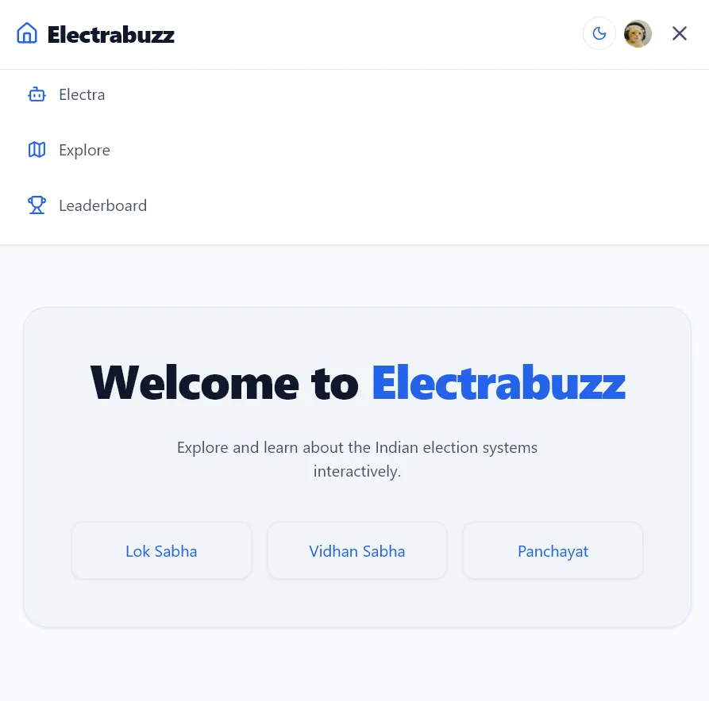

# Electrabuzz ⚡

Electrabuzz is an interactive platform designed to educate users about Indian elections and civics. It features a modern, user-friendly interface and a powerful AI Assistant that helps you understand complex political concepts, fact-check claims, and test your knowledge through interactive quizzes.

## 🎯 Chosen Vertical
**Civic Technology & Education (EdTech)**
Electrabuzz aims to bridge the knowledge gap in democratic processes by providing accessible, engaging, and AI-driven civic education, specifically focusing on Indian elections.

## 🧠 Approach and Logic
Our approach is centered around **interactive learning and AI-assisted fact-checking**. 
- **Explain & Test:** Instead of just providing static text, we use AI to dynamically explain political concepts and immediately reinforce that learning by generating contextual quizzes.
- **Combat Misinformation:** We integrated a dedicated "Fact-Check Mode" to help users verify political claims, providing them with a confidence score and detailed context.
- **Gamification:** We use a points system to reward users for answering quizzes correctly, encouraging continuous engagement.

## ⚙️ How the Solution Works
1. **User Authentication:** Users sign up or log in using Clerk for a secure, personalized experience.
2. **AI Interaction:** The core of the platform is powered by the Google Gemini API (via Vercel AI SDK). Users interact with the AI Assistant through two primary modes:
   - **Explain Mode:** The user asks a question, and the AI streams a detailed explanation followed by an automatically generated multiple-choice quiz based on the response.
   - **Fact-Check Mode:** The user submits a claim or rumor, and the AI evaluates its validity, returning a structured response (Verified, Misinformation, etc.) along with the factual context.
3. **Progress Tracking:** Authenticated users can earn points for correct quiz answers, with their progress tracked in their profile.

## 🛠️ Tech Stack
- **Frontend:** Next.js (React), Tailwind CSS
- **Authentication:** Clerk
- **AI Integration:** Vercel AI SDK, Google Gemini API

## 🤔 Assumptions Made
- **AI Accuracy:** We assume the underlying LLM (Gemini) provides accurate, unbiased information regarding Indian politics, though users should be encouraged to verify critical information.
- **Target Audience:** The primary audience is young voters, students, and citizens of India who are comfortable with English and web interfaces.
- **Connectivity:** Users have a stable internet connection capable of handling real-time AI response streaming.

---
### Getting Started Locally

If you want to run this project on your own computer:
1. Clone the repository.
2. Install dependencies by running `npm install`.
3. Create a `.env.local` file and add your `GOOGLE_GENERATIVE_AI_API_KEY` (Get one from Google AI Studio) and Clerk keys.
4. Run `npm run dev` to start the local server.
